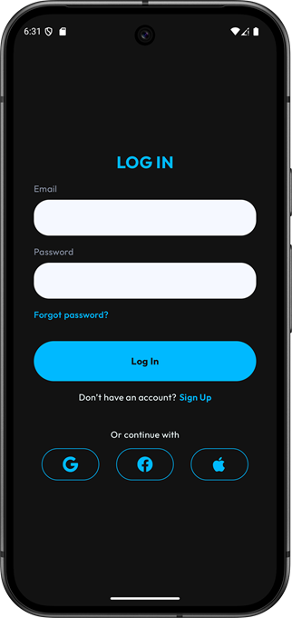
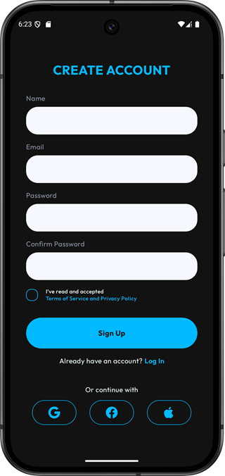
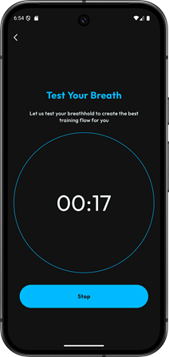
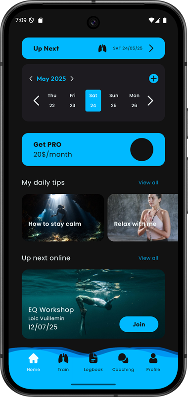
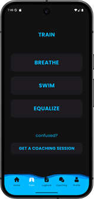
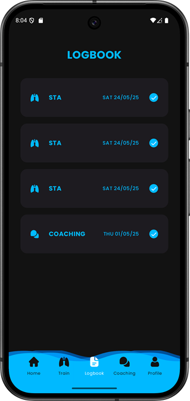
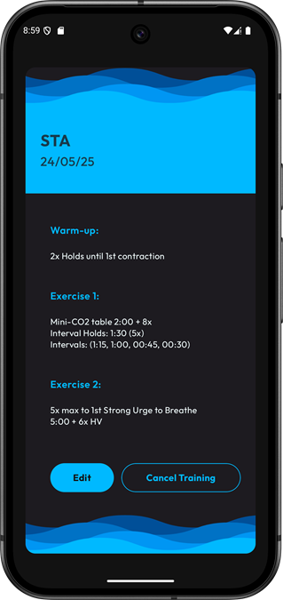
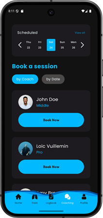
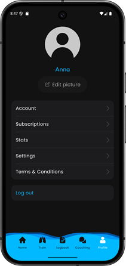

# 📘 Gidra

Мобільний застосунок для фрідайверів, що дозволяє проводити дихальні тренування, вести журнал сесій і планувати тренування з тренером.

---

## 👤 Автор

- **ПІБ**: Прізвище Ім’я
- **Група**: ФЕІ-44
- **Керівник**: Прізвище Ім’я, науковий ступінь, посада
- **Дата виконання**: [дд.мм.рррр]

---

## 📌 Загальна інформація

- **Тип проєкту**: Мобільний застосунок
- **Мова програмування**: Kotlin
- **Фреймворки / Бібліотеки**: Jetpack Compose, Koin, Room

---

## 🧠 Опис функціоналу

- 🔐 Авторизація користувачів через Firebase

- 🫁 Проходження тесту затримки дихання з таймером і збереженням результату

- 🏠 Home — центральний екран застосунку, який відображає календар активностей, рекомендації та найближчі івенти

- 🏋️ Train — розділ для тренувань, з переходами на вправи Breathe та Swim. Усередині доступні підрозділи на кшталт Tables чи Pranayama.

- 📘 Logbook — журнал із записами всіх завершених сесій. Дозволяє переглядати хронологію тренувань, а також переходити на екран з деталями кожного з них.

- 🎓 Coaching — розділ з бронюванням зайняття з тренером.

- 👤 Profile — персональний кабінет, де можна редагувати дані акаунту, переглядати статистику, оформлювати підписки, змінювати налаштування, а також ознайомлюватись з умовами користування.
---

## 🧱 Опис основних класів / файлів

| Клас / Файл     | Призначення |
|----------------|-------------|
| `GidraApp.kt`      | Точка входу. Ініціалізація залежностей |
| `MainActivity.kt`    | Ініціалізація UI |
| `FirebaseService.kt` | Контракт для усіх Firebase операцій |
| `TrainingsRepository.kt` | Контракт для усіх операцій таблиці Trainings |
| `Training.kt` | Модель таблиці Trainings |

---

## ▶️ Як запустити проєкт "з нуля"

### 1. Встановлення інструментів

- Завантажити Android Studio (остання версія)
- Встановити, обов'язково при встановленні Ініціалізувати емулятор і встановити SDK

### 2. Клонування репозиторію

- Розпаковка zip архіву з кодом

### 3. Відкрити проект

- File -> Open -> {path to project}

### 4. Запустити

- Запустити натисканням кнопки Run (або Shift+F10)

## 🔌 Приклади запитів у БД

### Витягнути тренування у певному часовому проміжку

**@Query("SELECT * FROM trainings WHERE date BETWEEN :startDate AND :endDate OR repeatEveryWeek LIKE 1")**


Повертаємо:

```
Flow<List<Training>>
```

---


### Вставити тренування

**@Insert(onConflict = OnConflictStrategy.REPLACE)**

Повертаємо:

```
Long(1 - успіх, 0 - помилка)
```

---

### Витягнути найближче тренування

**@Query("SELECT * FROM trainings WHERE date >= :now ORDER BY date ASC LIMIT 1")**

Повертаємо:

```
Training
```

---

## 🖱️ Інструкція для користувача

Запуск застосунку:

Після відкриття спрацьовує splash-екран.

Залежно від статусу користувача, автоматично визначається маршрут:

- 🧍 Неавторизований → екран авторизації

- ✅ Авторизований, без тесту → екран тесту затримки дихання

- ✅ Авторизований, з тестом → головна навігація

**Головна:**

🏠 Home — календар активностей, рекомендації та найближчі івенти

🏋️‍♀️ Train — тут можна обрати та пройти тренування

📘 Logbook — список завершених сесій із деталями

🎓 Coaching — бронювання занять з тренером

👤 Profile — управління акаунтом (редагування профілю, оформлення підписки, статистика, вихід)

---

## 📷 Cкриншоти

- Логін / реєстрація


- Тест дихання

- Головна сторінка

- Тренування

- Логбук


- Вибір тренера

- Профіль


---

## 🧪 Проблеми і рішення

| Проблема              | Рішення                            |
|----------------------|------------------------------------|
| Не працює встановлення з APK-файлу | Увімкнути дозвіл на встановлення з невідомих джерел у налаштуваннях пристрою | 
| Додаток закривається одразу після запуску | Очистити кеш та дані застосунку, та спробуваи знову |

---

## 🧾 Використані джерела / література

- Kotlin офіційна документація
- Firebase офіційна документація
- Medium
- StackOverflow
